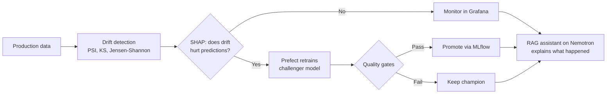

<div align="center">


<br/>

<a href="https://www.linkedin.com/in/mohvijayjn/"></a>
<a href="mailto:mohvijayjain12@gmail.com"></a>


</div>

<br/>

```python
class Mohvijay:
    role      = "AI/ML Engineer | B.Tech CSE (Data Science) @ Bennett University"
    builds    = ["RAG systems", "LLM applications", "MLOps pipelines"]
    cares_about = ["grounded answers", "measurable quality", "systems that ship"]
    learning  = ["LangGraph", "multi-agent workflows"]
    open_to   = "AI/ML and GenAI internships"
```

---

## 🛡️ Featured: Sentinel-AI

**A self-healing ML platform.** It watches a production model, figures out whether incoming data drift actually hurts predictions, retrains only when it matters, and uses an LLM to explain every decision in plain English.



<table>
<tr>
<td align="center"><b>6.9M+</b><br/><sub>records</sub></td>
<td align="center"><b>R² ≈ 0.86</b><br/><sub>trip duration model</sub></td>
<td align="center"><b>MAE ≈ 3.3 min</b><br/><sub>prediction error</sub></td>
<td align="center"><b>3</b><br/><sub>drift tests combined</sub></td>
</tr>
</table>

        

👉 **[View repository](https://github.com/mohvijayjain/Sentinel-AI)**

---

## 📚 More Projects

<table>
<tr>
<td width="50%" valign="top">

### ScholarRAG
Grounded Q&A over research papers. Parses PDFs section by section, answers with page-level citations, and refuses when the evidence isn't there.

**0.85** faithfulness · **1.0** context recall (RAGAS)

<sub>LangChain · ChromaDB · BGE · NVIDIA NIM · FastAPI</sub>

👉 **[View repository](https://github.com/mohvijayjain/ScholarRAG)**

</td>
<td width="50%" valign="top">

### GeoSight
Land cover classification and road network analysis across 5 Indian states from satellite imagery, with zero manual labeling.

**97.79%** pixel accuracy · **0.9154** mIoU · **66K+** tiles

<sub>Python · Remote sensing · Graph theory</sub>

👉 **[View repository](https://github.com/mohvijayjain/GeoSight)**

</td>
</tr>
</table>

---

## 🧰 Toolkit

| | |
|:---|:---|
| **Languages** |  |
| **GenAI / LLM** | `RAG` `LangChain` `ChromaDB` `NVIDIA NIM` `RAGAS` `Prompt Engineering` |
| **ML** | `Scikit-learn` `LightGBM` `Optuna` `SHAP` `Pandas` `NumPy` |
| **MLOps** | `MLflow` `Prefect` `Evidently AI` `Prometheus` `Grafana` |
| **Backend & Cloud** |  |

---

## 🏆 Highlights

- ☁️ **AWS Certified Cloud Practitioner**
- 🚀 **Perplexity AI Campus Ambassador** at Bennett University
- 💡 **Smart India Hackathon** Inter-College Round: Rank **61 / 561**

---

<div align="center">


<br/>

**Building something with LLMs or MLOps? Let's talk.**

<a href="mailto:mohvijayjain12@gmail.com"></a>


</div>
